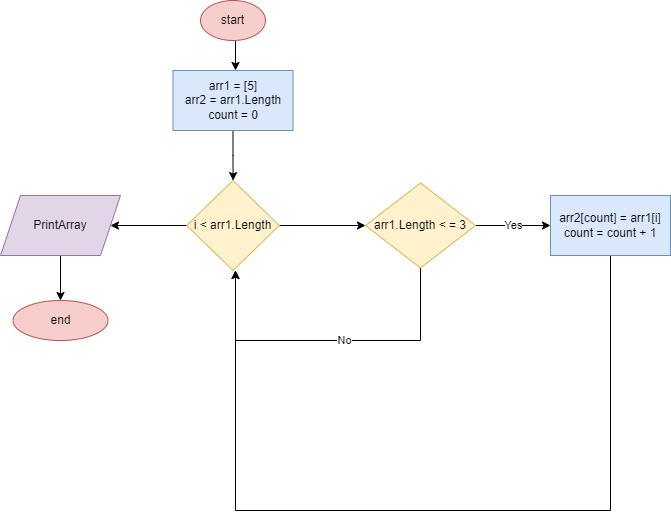

# Итоговая проверочная работа

## Задача
Написать программу, которая из имеющегося **массива** строк формирует массив из строк, длина которых *меньше либо равна 3 символам*. Первоначальный массив можно ввести с клавиатуры, либо задать на старте выполнения алгоритма. При решение не рекомендуется пользоваться коллекциями, лучше обойтись исключительно массивами.

## Описание решения задачи
Создаем два массива равной длины, изначальный массив задаем на старте программы. Потом создаем цикл(**for**) равный длине массива. Внутри цикла проверка условия (**<= 3**), если да, то элемент первого массива заносится в элемент второго массива(**arr2[count]**). Переменная **count** позволяет поочередно заносить элементы из первого массива во второй, чтобы не было пробелов. После присвоения переменная **count** увеличивается на 1 и возвращается к циклу **for**. И так до тех пор, пока условие выполняется. В конце выводится новый массив, состоящий из элементов, длина которых **меньше или равна 3**.

## Блок-схема

## Реализация алгоритма в Task/Program.cs
Массив - [hello, 2, world, :-)]

Результат - [ 2 :-)  ]